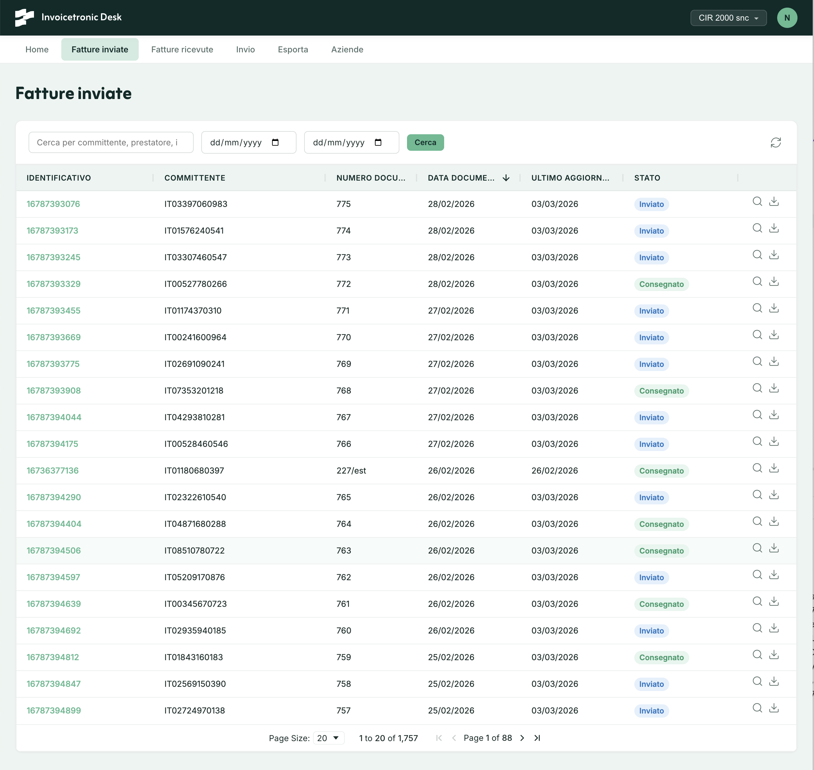

# Invoicetronic Desk

Open-source, white-label web app for Italian electronic invoicing (FatturaPA/SDI). Available as a cloud service or self-hosted with Docker. Customize with your brand, manage invoices in minutes.

Desk is a ready-to-use frontend for the [Invoicetronic API](https://invoicetronic.com). ISVs and developers can self-host it, apply their own branding, and give their customers a complete invoicing interface — without writing a single line of UI code.



## Features

- **Send & receive invoices** — full-text search, date filters, server-side pagination, XML download
- **Invoice detail** — metadata and complete SDI status timeline
- **Upload** — drag-and-drop multi-file upload
- **Export** — filter by month/quarter/date range, download as ZIP
- **Company management** — CRUD for companies linked to your API key
- **Dashboard** — recent invoices overview and counters
- **Two auth modes** — multi-user (Identity + login) or standalone (single API key, no login)
- **White-label** — custom app name, footer, CSS variables, logo
- **Localization** — Italian (default) and English
- **Docker ready** — multi-stage build, health check endpoint

## Quick start

### 1. Get an API key

Sign up at [invoicetronic.com](https://invoicetronic.com) and get your API key from the dashboard. Desk works with both **sandbox** and **live** API keys — the environment is determined by the key you use. Start with a sandbox key for testing, then switch to live when you're ready. See the [Sandbox](https://invoicetronic.com/en/docs/sandbox/) and [API Keys](https://invoicetronic.com/en/docs/apikeys/) documentation pages for details.

### 2. Cloud (recommended)

The fastest way to get started. No Docker, no servers, no configuration — just sign up at **[desk.invoicetronic.com](https://desk.invoicetronic.com)** and start working.

### 3. Self-hosted (free)

#### Deploy with Docker

**Standalone mode** (single API key, no login — ideal for internal networks):

```yaml
# docker-compose.yml
services:
  desk:
    image: invoicetronic/desk
    ports:
      - "8080:8080"
    volumes:
      - ./desk.yml:/app/desk.yml
```

```yaml
# desk.yml
desk:
  api_key: itk_live_xxxxxxxxxx
```

> **Tip:** to avoid storing the API key in a file, pass it via environment variable instead:
>
> ```yaml
> # docker-compose.yml
> services:
>   desk:
>     image: invoicetronic/desk
>     ports:
>       - "8080:8080"
>     environment:
>       - Desk__api_key=itk_live_xxxxxxxxxx
> ```

```bash
docker compose up -d
```

Open `http://localhost:8080` — no registration needed, the app is ready to use.

**Multi-user mode** (each user registers and enters their own API key):

```yaml
# docker-compose.yml
services:
  desk:
    image: invoicetronic/desk
    ports:
      - "8080:8080"
    volumes:
      - ./desk.yml:/app/desk.yml    # optional
      - ./data:/app/data            # persist user database
```

```bash
docker compose up -d
```

Open `http://localhost:8080`, register, and enter your API key in the profile page.


#### Build from source

Requires [.NET 10 SDK](https://dotnet.microsoft.com/download/dotnet/10.0).

```bash
git clone https://github.com/invoicetronic/desk.git
cd desk
cp src/desk.yml.example src/desk.yml
dotnet run --project src
```

The app starts at `http://localhost:5100`. Edit `src/desk.yml` to configure it — see `src/desk.yml.example` for all available options.

> **Note:** Safari forces HTTPS on `localhost`. Use `http://127.0.0.1:5100` instead, or trust the .NET dev certificate with `dotnet dev-certs https --trust`.

## Configuration

All configuration goes in `desk.yml`. The file is optional — sensible defaults are used when it's absent. To get started, copy the example:

```bash
cp src/desk.yml.example src/desk.yml
```

```yaml
desk:
  # API endpoint (default: https://api.invoicetronic.com/v1)
  api_url: https://api.invoicetronic.com/v1

  # API key — if set, enables standalone mode (no login required)
  # If omitted, multi-user mode is active (registration + login)
  # api_key: itk_live_xxxxxxxxxx

  # Database (ignored in standalone mode)
  database:
    provider: sqlite    # sqlite | pgsql
    # SQLite default path: data/desk.db (persisted with ./data:/app/data volume)
    # For PostgreSQL: Desk__database__connection_string=Host=...;Database=desk;...

  # Branding
  branding:
    app_name: My Invoicing App
    footer_text: "Powered by <a href=\"https://example.com\">My Company</a>"
    logo_url: https://example.com/logo-light.svg       # navbar (dark background)
    logo_dark_url: https://example.com/logo-dark.svg    # auth pages (light background)
    favicon_url: https://example.com/favicon.png
    primary_color: "#1A237E"
    accent_color: "#E91E63"

  # Language — if omitted, auto-detected from browser
  # locale: it    # it | en
```

Environment variables override YAML values using the `Desk__` prefix (e.g., `Desk__database__connection_string`).

> **Secrets:** for sensitive values like the API key, prefer environment variables over `desk.yml`:
>
> ```bash
> export Desk__api_key=itk_live_xxxxxxxxxx
> ```
>
> In Docker, use `environment:` in your compose file or Docker secrets. This keeps credentials out of config files and version control.

### Standalone vs multi-user

| | Standalone | Multi-user |
|---|---|---|
| **When** | `api_key` is set in desk.yml | `api_key` is absent |
| **Auth** | None — all pages accessible | Registration + login required |
| **API key** | Shared, from config | Per-user, stored in profile |
| **Database** | In-memory (no file on disk) | SQLite file (`desk.db`) or PostgreSQL |
| **Use case** | Internal network, VPN, single tenant | SaaS, multi-tenant, public-facing |

> **Warning**: in standalone mode anyone who can reach the host has full access. Use only in trusted networks.

### Password reset (SMTP)

In multi-user mode, users can reset their forgotten password via email. To enable this, configure an SMTP server in `desk.yml`:

```yaml
desk:
  smtp:
    host: smtp.example.com
    port: 587                  # 587 (StartTLS) | 465 (SSL)
    username: user@example.com
    password: secret
    sender_email: noreply@example.com
    sender_name: My App
```

Only `host` and `sender_email` are required. If the `smtp` section is not configured, the "Forgot password?" link is not shown on the login page.

> **Tip:** pass SMTP credentials via environment variables to keep them out of config files:
>
> ```yaml
> # docker-compose.yml
> environment:
>   - Desk__smtp__host=smtp.example.com
>   - Desk__smtp__port=587
>   - Desk__smtp__username=user@example.com
>   - Desk__smtp__password=secret
>   - Desk__smtp__sender_email=noreply@example.com
> ```

## Theming

Customize colors, logo, and favicon directly in `desk.yml` under the `branding` section (see [Configuration](#configuration) above). All properties are optional — if omitted, Invoicetronic defaults are used.

| Property | Description |
|---|---|
| `app_name` | Application name shown in navbar and page titles |
| `footer_text` | Footer HTML |
| `logo_url` | Logo for the navbar (dark background). URL or path |
| `logo_dark_url` | Logo for auth pages (light background). URL or path |
| `favicon_url` | Browser favicon. URL or path |
| `primary_color` | Primary brand color (hex, e.g. `"#1A237E"`) |
| `accent_color` | Accent color for links and buttons (hex, e.g. `"#E91E63"`) |

### Advanced CSS overrides

For full control over the design system, mount a `custom/theme.css` file that overrides any CSS custom property:

```css
:root {
    --brand-primary: #1A237E;
    --brand-accent: #E91E63;
    --brand-font-heading: "Poppins", sans-serif;
}
```

```yaml
# docker-compose.yml
volumes:
  - ./my-theme.css:/app/wwwroot/custom/theme.css
```

## Localization

Desk supports **Italian** and **English**. By default the language is auto-detected from the browser's `Accept-Language` header, with Italian as the fallback.

To force a specific language for all users, set `locale` in `desk.yml`:

```yaml
desk:
  locale: en    # it | en
```

All UI strings — including Identity pages (login, registration, password reset) and validation errors — are fully localized.

## Architecture

```
Desk (this project)  →  frontend for end users (invoicing operations)
Dashboard            →  developer panel (API keys, billing, logs, webhooks)
API                  →  shared backend (invoicetronic.com/v1)
Website              →  documentation and marketing (invoicetronic.com)
```

| Project | Link |
|---|---|
| **Desk** | [desk.invoicetronic.com](https://desk.invoicetronic.com) |
| **Dashboard** | [dashboard.invoicetronic.com](https://dashboard.invoicetronic.com) |
| **API** | [API reference](https://api.invoicetronic.com/v1/docs) |
| **Website & docs** | [invoicetronic.com](https://invoicetronic.com) |

Desk has no billing logic — it's a pure operational frontend. Authorization is entirely in the API, driven by the API key.

## Tech stack

| Layer | Technology |
|---|---|
| Backend | ASP.NET Core 10.0 + Razor Pages |
| Data grid | AG Grid Community (MIT) |
| UI | Custom CSS design system (no Bootstrap) |
| Auth | ASP.NET Core Identity |
| Database | SQLite (default) / PostgreSQL |
| Config | YAML (`desk.yml`) |
| Container | Docker multi-stage |

## Health check

```
GET /health → {"status":"healthy"}
```

## License

[Apache License 2.0](LICENSE)
